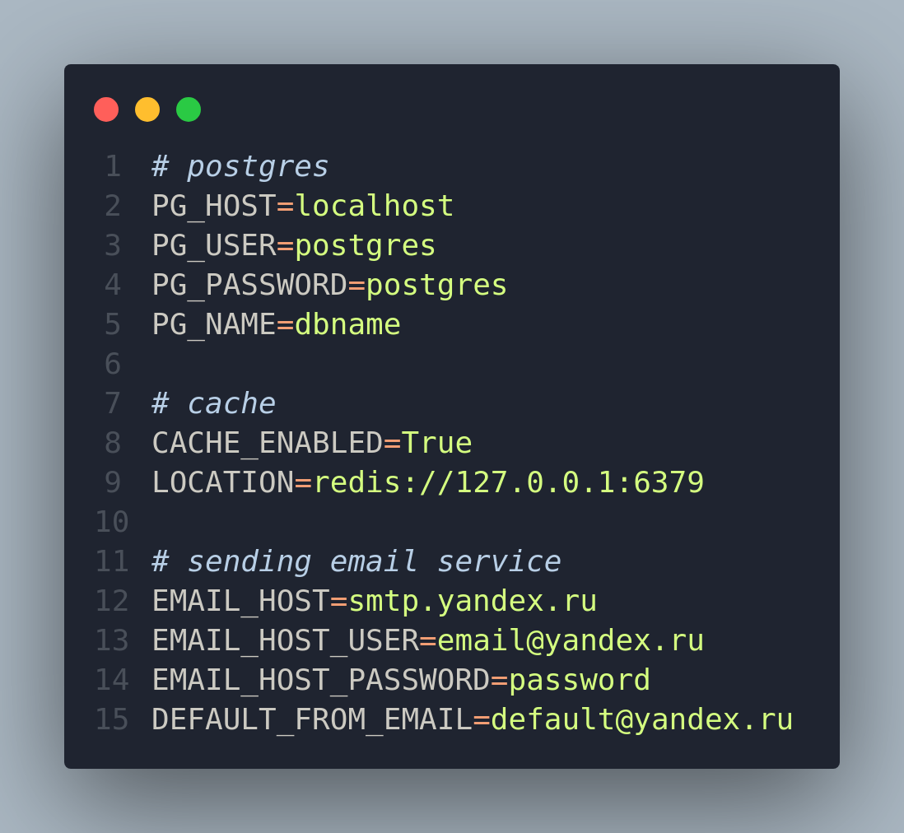
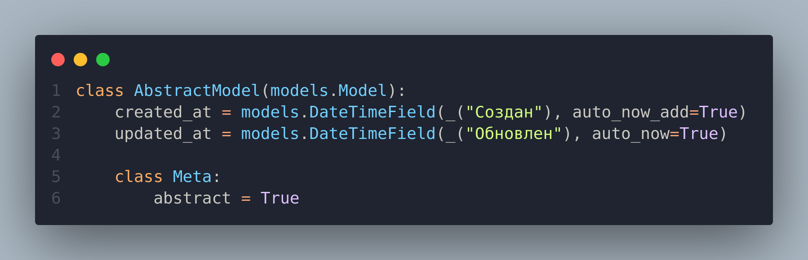
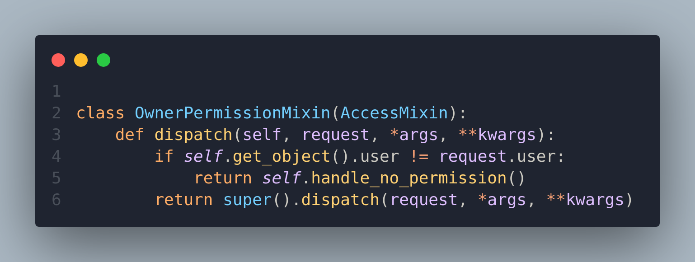
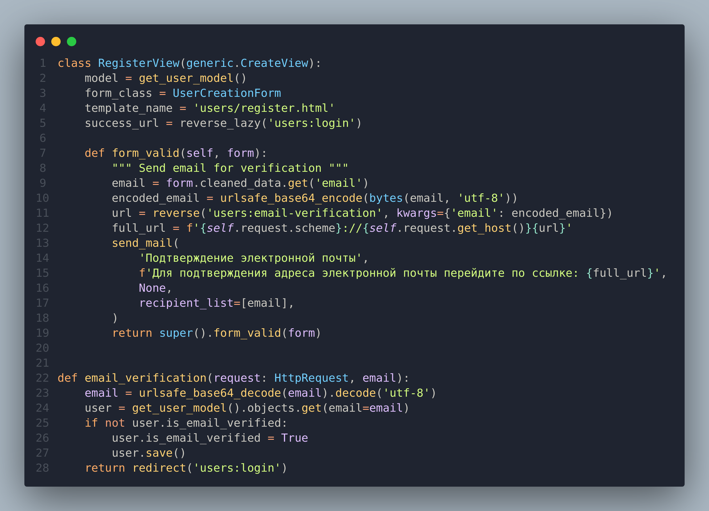

# Пререквизиты

1. Создать .env файл
   

2. Создать Postgres БД, внести название бд в PG_NAME
3. Создать Redis БД. В проекте используется как брокер сообщений для Celery и кеширования главной страницы
4. Настроить smtp сервис для рассылок электронной почты (тестировал на Яндексе)
5. Проинициализировать необходмые сущности: 
    * Общая команда для выполнения миграций, создания группы для менеджеров, интервалов дсайталя рассылок, постов для главной страницы
    ```
    python manage.py init
    ```
    * Провести миграции
    ```
    python manage.py migrate
    ```
    * Создать группу для менеджеров 
    ```
    python manage.py creategroup manager
    ```
    * Создать интервалы для рассылок 
    ```
    python manage.py createintervals
    ```
    * Создать посты для отображения на главной странице 
    ```
    python manage.py createposts
    ```
    * Создать суперюзера
    ```
    python manage.py createsupeuser
    ```
    * Создать менеджера
    ```
    python manage.py createmanager
    ```
6. Запустить проект
    * Запуск сервера
    ```
    python manage.py runserver
    ```
    * Запуск Celery
    ```
    celery -A config worker --beat --scheduler django --loglevel=info
    ```

# Пояснительная записка 
В проекте 5 самописных приложений. Main, Users, Clients, Mailing, Posts. 

## Main
Cлужит точкой входа для пользователей сервиса и настроено для отображения главной страницы. Дополнительно содержит Базовую Абстрактную модель для всех остальных моделей.
 

Содержит permission миксин, который служит для проверки объектов на принадлежность юзеру, который делает запрос


## Users
Убран username из модели, регистрация и авторизация проходят по email. При регистрации на сайте на указанный email отправляется письмо для подтверждения адреса электронной почты с ссылкой для перехода.


## Clients
Содержит единственную модель Client с привязкой к конткретному пользователю. Создал отдельным приложением, из соображений, что можно будет в дальнейшем использовать в других приложениях, не только для "Рассылок"


## Mailings
Итак, рассылки работают через django_celery_beat. 
В "beat" есть PeriodicTask, в которой можно задать:
* Функцию для исполнения
* Время старта
* Интервал

В "celery-results" есть TaskResult, которая содержит информацию о времени начала выполнения задачи, времени заверщения, статусе операции и значением оператора return выполненной функции.

## Posts
Для "блога" нет никакого интерфейса, только отображение 3ёх случайных статей на главной странице. Статьи можно сгенерировать командой createposts (смотри перреквизиты). Модель зарегистрирована в админке джанго.
